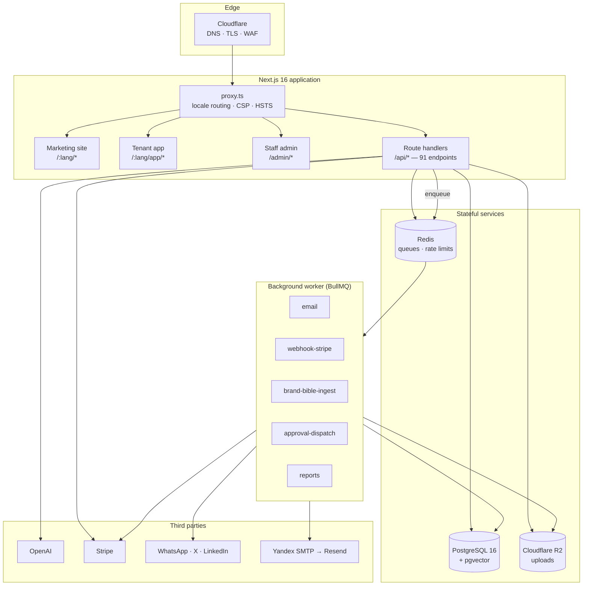

# Staffbix

**A multi-tenant platform for running a company on AI employees.**

Staffbix lets a business hire AI workers from a catalog of 64 roles —
customer support, SDR, SEO specialist, bookkeeper, recruiter, logistics
coordinator — point them at a shared company knowledge base, and let them
work across real channels: a website chat widget, WhatsApp, inbound email,
X, and LinkedIn. Every worker runs under an autonomy setting the owner
chooses, and anything above that threshold lands in an Approval Center
instead of going out.

The product thesis is narrow and deliberate: *one person should be able to
operate a real company.* Not a chatbot, not a prompt library — a workforce
with shared memory, enforceable spending and permission limits, an audit
trail, and a human in the loop where it matters.

This repository is the full Next.js application: marketing site, tenant
app, staff admin panel, public API, and the background worker.

---

## Table of contents

- [What's in the box](#whats-in-the-box)
- [Architecture](#architecture)
- [Tech stack](#tech-stack)
- [Repository layout](#repository-layout)
- [The AI worker runtime](#the-ai-worker-runtime)
- [Data model](#data-model)
- [Security model](#security-model)
- [Internationalization](#internationalization)
- [Getting started](#getting-started)
- [Environment variables](#environment-variables)
- [Scripts](#scripts)
- [Deployment](#deployment)
- [Continuous integration](#continuous-integration)
- [Project status and known limitations](#project-status-and-known-limitations)
- [License](#license)

---

## What's in the box

| | |
|---|---|
| **Role catalog** | 64 seeded AI roles; 56 have concrete tool implementations |
| **Agent tools** | 123 typed, tenant-scoped tool functions across 62 role modules |
| **Channels** | Embeddable web widget, WhatsApp Cloud API, inbound email (HMAC webhook), X, LinkedIn |
| **Knowledge base** | "Brand Bible" — PDF/DOCX upload plus URL ingestion, chunked, embedded, retrieved with pgvector |
| **Approval Center** | Per-worker `auto` / `approve` / `suggest` autonomy, with Expo push + email dispatch |
| **Billing** | Stripe subscriptions, plan seat/worker limits, invoices, refunds, customer portal |
| **Admin panel** | Separate cookie scope and staff table: tenants, users, plans, audit, announcements, platform integrations |
| **Reports** | Scheduled and on-demand reports, run history, queue-driven execution |
| **Localization** | 23 locales, machine-translated with a reviewed English source of truth |
| **Public API + docs** | 91 route handlers, plus in-app API reference, SDK pages, webhook and rate-limit docs |

Roughly 97k lines of hand-written TypeScript across 487 files, plus about
105k lines of generated translation tables.

---

## Architecture



Three surfaces share one deployment. `src/proxy.ts` (Next.js 16 renamed
Middleware to Proxy) is the single edge entry point: it negotiates locale,
rewrites paths, stamps security headers on every response, and rejects
stray Server Action requests — the app uses none, so any request carrying
a `Next-Action` header is a stale tab or a probe.

Anything slow or retryable is a queue job, never an inline await. HTTP
handlers enqueue; `src/worker/index.ts` runs five BullMQ workers in a
separate process so a slow SMTP handshake or a 60-second ingest never
occupies a request thread.

---

## Tech stack

| Layer | Choice | Notes |
|---|---|---|
| Framework | Next.js 16.3.1 (App Router) | Route handlers only — zero React Server Actions, by design |
| UI | React 19.2, Tailwind CSS 4, Motion | 47 components, no component library |
| Language | TypeScript 5, strict | `isolatedModules`, no `any` escapes in the auth path |
| Database | PostgreSQL 16 + pgvector | 34 tables, 21 migrations |
| ORM | Drizzle ORM 0.45 + drizzle-kit | Schema-first, migrations checked in CI |
| Queues | BullMQ 5 on Redis (ioredis) | 5 queues, exponential backoff |
| Auth | Custom — Argon2id, opaque sessions, email OTP, TOTP | `@node-rs/argon2`, `@oslojs/*` |
| Payments | Stripe 22 | Subscriptions, invoices, refunds, tax |
| Storage | Cloudflare R2 via `@aws-sdk/client-s3` | Tenant-prefixed keys |
| AI | OpenAI (`gpt-4o-mini`, `text-embedding-3-small`), Anthropic SDK | Per-tenant usage and spend accounting |
| Mail | Nodemailer (Yandex SMTP) with Resend fallback | Circuit breaker, 5-minute probe interval |
| Validation | Zod 4 | Tool arguments and request bodies |

---

## Repository layout

```
src/
  app/
    [lang]/            Marketing site, tenant app, docs, legal — 23 locales
    admin/(panel)/     Staff-only admin panel, separate cookie scope
    api/               91 route handlers (auth, billing, workers, webhooks, widget)
    status/            Public status page
  components/          47 React components (admin, app, auth, contact, help)
  lib/
    ai/                OpenAI client, chat, embeddings, retrieval, usage accounting
    ai/tools/          123 agent tools across 62 role modules + registry
    approvals/         Approval Center runtime and dispatch
    auth/              Sessions, guards, OTP, TOTP, passwords, rate limits, tokens
    billing/           Plan limits and entitlement checks
    brand-bible/       Upload parsing, URL fetch (SSRF-guarded), chunking, ingest
    crypto/            AES-256-GCM envelope encryption, per-tenant DEKs
    db/schema/         25 Drizzle schema modules
    help/              In-app help center, 64 per-agent guides
    i18n/              Locale config, routing, copy tables
    integrations/      WhatsApp, X, LinkedIn, OAuth2 + PKCE
    mail/              Transport, templates, localized copy
    queue/             Queue definitions, Redis client, scheduler
    seo/               Metadata, sitemap, JSON-LD
    storage/           R2 client and tenant key derivation
  messages/            23 locale JSON files
  worker/index.ts      BullMQ worker process entry point
drizzle/               21 SQL migrations + drizzle-kit snapshots
scripts/               Translation, seeding, and audit tooling
```

---

## The AI worker runtime

### Roles and tools

A worker is a row in `workers`: a role slug, a language, a channel, an
autonomy level, a model pin, and a JSON settings blob. The role slug
resolves through `src/lib/ai/tools/registry.ts` to a list of tools the
worker is allowed to call.

Tools are ordinary typed functions with a Zod argument schema and a
`ctx` carrying `tenantId`. Every database read inside a tool is scoped by
that tenant id — tenant isolation is enforced at the query, not by a
middleware anyone can forget to add.

```ts
// src/lib/ai/tools/email-marketer/segment-audience.ts (abridged)
const clauses = [eq(leads.tenantId, ctx.tenantId)];   // always, first
if (status) clauses.push(eq(leads.status, status));
if (minScore !== null) {
  clauses.push(
    sql`COALESCE((${leads.metadata}->>'qualificationScore')::int, 0) >= ${minScore}`,
  );
}
```

### Autonomy and the Approval Center

Every worker carries one of three autonomy levels, defaulting to the
cautious one:

| Level | Behaviour |
|---|---|
| `auto` | The side effect runs immediately; a `worker_actions` row is written with `status='auto'` for the audit trail |
| `approve` | A `pending` row is written and the owner is notified; the customer sees nothing until a human approves |
| `suggest` | Same storage path as `approve`; the UI presents it as a draft the human sends themselves |

`src/lib/approvals/runtime.ts` owns dispatch. On approval it performs the
real side effect — post the tweet, send the WhatsApp message, release the
drafted reply — refreshing OAuth tokens where the provider requires it.

### Retrieval

Brand Bible sources are uploaded as PDF/DOCX or fetched from a URL, parsed
to text, chunked, embedded with `text-embedding-3-small` (1536 dimensions,
batched 100 at a time), and stored in `brand_bible_chunks`. Retrieval is a
pgvector cosine search scoped to the tenant and to sources in `ready`
state:

```sql
SELECT ..., embedding <=> $query::vector AS distance
FROM brand_bible_chunks
INNER JOIN brand_bible_sources ON ...
WHERE tenant_id = $tenant AND status = 'ready'
ORDER BY embedding <=> $query::vector
LIMIT $k
```

URL ingestion is SSRF-guarded: every hostname — the original and each of
up to four redirect hops — is DNS-resolved and rejected if it maps to
loopback, private, link-local, CGNAT, or IPv6 ULA space. Cloud metadata
endpoints (`169.254.0.0/16`) are covered by the link-local rule.

### Cost accounting

Every model call is recorded in `ai_usage` with tenant, worker, and
conversation attribution, and rolled up into `tenant_ai_spend`. Plan
limits are enforced against these tables rather than against a counter in
memory.

---

## Data model

34 tables. The ones that carry the most weight:

| Table | Purpose |
|---|---|
| `tenants` | Tenant root; lifecycle `trialing → active → past_due → suspended → canceled` |
| `users` | Tenant members. Composite identity — one email may exist in several tenants |
| `staff` | Platform employees. Separate from `users`; gates the admin panel |
| `sessions` | Opaque tokens, stored only as SHA-256(token + pepper), with an OTP-pending flag |
| `workers` | Hired AI employees: role, channel, autonomy, model pin, settings |
| `worker_actions` | Every action a worker took or proposed — the approval queue and the audit trail |
| `conversations`, `messages` | Channel-agnostic threads |
| `brand_bible_sources`, `brand_bible_chunks` | Knowledge base and its embeddings |
| `integrations` | Per-tenant channel credentials, encrypted at rest |
| `tenant_keks` | Wrapped per-tenant data-encryption keys |
| `plans`, `platform_invoices` | Billing catalog and invoice history |
| `security_events` | Structured audit log — logins, rate limits, admin actions |
| `ai_usage`, `tenant_ai_spend` | Token and cost attribution |

Migrations live in `drizzle/` and are replayed against a scratch
`pgvector/pgvector:pg16` container in CI, so drift between the TypeScript
schema and the SQL is caught on every pull request.

---

## Security model

This is the part of the codebase that had the most attention paid to it.

**Passwords.** Argon2id via `@node-rs/argon2`, 64 MiB memory cost, time
cost 3, parallelism 4 — OWASP guidance for a server with ≥1 GiB RAM.
Minimum length 12. Costs may be raised, never lowered; the hash format
records its own parameters so old hashes keep verifying.

**Sessions.** The cookie holds a 32-byte opaque token, base32-encoded. The
database stores only `SHA-256(token || SESSION_HASH_PEPPER)`. A read-only
database leak is therefore not enough to forge a session, because the
pepper lives in the environment, not in Postgres. Cookies are HttpOnly,
`SameSite=Lax`, and `Secure` in production.

**Two-step login.** A password check creates an *OTP-pending* session. The
cookie is set immediately so the OTP page can read it, but no protected
route grants access until `otp_verified_at` is set. Users who have
enrolled can verify with TOTP instead of the emailed code.

**Login abuse.** Two limiters — per-email (5 per 15 min) and per-IP — plus
account lockout after 5 consecutive failures for 30 minutes. Unknown
emails still pay the cost of a real Argon2 verification against a fixed
dummy hash, so response time doesn't reveal which addresses are
registered.

**Two cookie scopes.** `staffbix_sid` for tenants, `staffbix_admin_sid`
for staff. Admin scope requires an `active` row in the `staff` table —
checked at login *and* re-checked on every request, so deactivating
someone takes effect immediately rather than when their 14-day cookie
expires.

**Secrets at rest.** Integration credentials and TOTP seeds are stored as
AES-256-GCM ciphertext under envelope encryption: a per-tenant
data-encryption key, itself wrapped by `TENANT_KEK_MASTER`. Blobs are
versioned, so rotating one tenant's key doesn't require re-encrypting
every other tenant's rows.

**Webhooks.** Stripe is verified with `stripe.webhooks.constructEvent`.
Inbound email is verified with HMAC-SHA256 over the raw body against a
per-tenant secret, compared with `timingSafeEqual`; a tenant without a
configured secret gets a 401 rather than an unauthenticated fallback path.
WhatsApp uses Meta's signature scheme.

**OAuth.** X and LinkedIn use OAuth2 with PKCE. The `state` parameter is
bound to a short-lived cookie and compared on callback; a mismatch fails
closed.

**Rate limiting.** A Redis sliding window over sorted sets, in six named
buckets (`otp`, `login`, `register`, `api`, `chat`, `widgetIp`). The
public widget is limited twice — once per browser-supplied session id and
once per network origin, because the session id is client-generated and an
abuser can simply rotate it. Every 429 writes an `api.rate_limited`
security event.

**Response headers.** `src/proxy.ts` stamps CSP, HSTS with `preload`,
`X-Content-Type-Options`, `X-Frame-Options: DENY`, `Referrer-Policy`, and
a `Permissions-Policy` denying camera, microphone, and geolocation — on
every response, including redirects and API responses.

**Tenant isolation.** Every tenant-scoped query filters on `tenant_id` at
the query site. R2 object keys are prefixed `tenants/{tenantId}/…` with a
random nonce and a sanitized filename.

**Trusting the edge.** `cf-connecting-ip` and `x-forwarded-for` are just
request headers; a host reachable outside the CDN can be fed forged
values. Set `TRUSTED_PROXY_SECRET` and add a Cloudflare Transform Rule
emitting `x-edge-proof: <same value>`, and unproven requests get no client
IP at all rather than an attacker-chosen one. This is opt-in — leave it
unset and behaviour is unchanged, so a misconfigured rule can never lock
out real users.

### Reporting a vulnerability

Open a GitHub issue with enough detail to reproduce. Please don't file
public exploit code for anything unpatched.

---

## Internationalization

23 locales: Arabic, Chinese, Danish, Dutch, English, Finnish, French,
German, Hebrew, Hindi, Italian, Japanese, Korean, Malay, Norwegian,
Polish, Portuguese, Russian, Spanish, Swedish, Thai, Turkish, Ukrainian.

English is the source of truth. Everything else is machine-translated into
checked-in generated tables (`src/lib/i18n/generated-copy-translations.ts`,
`src/lib/help/translations.generated.ts`, `src/lib/mail/copy.generated.ts`)
keyed by the English string, so a copy change invalidates exactly the
strings it touches.

`npm run i18n:audit` reports hardcoded user-facing strings and any key
that is missing from or extra in a locale file relative to English. It
runs in CI, so a locale can't silently drift.

Right-to-left locales (Arabic, Hebrew) are handled through the locale
config rather than per-component overrides.

---

## Getting started

### Prerequisites

- Node.js 22+
- PostgreSQL 16 with the `pgvector` extension — the
  `pgvector/pgvector:pg16` image is the easiest route
- Redis 7+

```bash
docker run -d --name staffbix-pg -p 5432:5432 \
  -e POSTGRES_PASSWORD=postgres -e POSTGRES_DB=staffbix \
  pgvector/pgvector:pg16
```

```bash
docker run -d --name staffbix-redis -p 6379:6379 redis:7-alpine
```

### Install and configure

```bash
npm install
```

```bash
cp .env.example .env.local
```

Generate the two required secrets and paste them into `.env.local`:

```bash
openssl rand -hex 32
```

That value goes in `SESSION_HASH_PEPPER`; run it again for
`TENANT_KEK_MASTER`. The app refuses to boot without both.

### Migrate and run

```bash
npm run db:migrate
```

```bash
npm run dev
```

The background worker is a separate process — queued email, ingestion,
reports, and approval dispatch do nothing until it runs:

```bash
npm run worker:dev
```

Open <http://localhost:3000>. Without a `TWITTER_*` / `LINKEDIN_*` /
WhatsApp integration configured, those channels surface as unconfigured in
the UI rather than failing at runtime.

---

## Environment variables

`.env.example` is the authoritative list and documents how to obtain each
value. Summary:

| Group | Variables | Required |
|---|---|---|
| Core | `NODE_ENV`, `PUBLIC_APP_URL`, `PUBLIC_ADMIN_URL`, `PUBLIC_MARKETING_URL` | yes |
| Data | `DATABASE_URL`, `REDIS_URL` | yes |
| Auth | `SESSION_HASH_PEPPER`, `TENANT_KEK_MASTER` | yes |
| Auth (mobile) | `MOBILE_JWT_PRIVATE_KEY`, `MOBILE_JWT_PUBLIC_KEY` | for mobile tokens |
| Edge | `TRUSTED_PROXY_SECRET` | recommended in production |
| AI | `OPENAI_API_KEY`, `ANTHROPIC_API_KEY` | for worker chat and embeddings |
| Payments | `STRIPE_SECRET_KEY`, `STRIPE_WEBHOOK_SECRET`, `STRIPE_TAX_ENABLED` | for billing |
| Mail | `YANDEX_SMTP_*`, `SYSTEM_MAIL_FROM`, `RESEND_API_KEY` | for outbound mail |
| Storage | `R2_ACCOUNT_ID`, `R2_ACCESS_KEY_ID`, `R2_SECRET_ACCESS_KEY`, `R2_BUCKET_*`, `R2_ENDPOINT`, `R2_PUBLIC_URL` | for uploads |
| Observability | `AXIOM_TOKEN`, `AXIOM_DATASET`, `AXIOM_ORG_ID` | optional |
| Push | `EXPO_ACCESS_TOKEN` | for approval push notifications |
| Social | `TWITTER_CLIENT_ID/SECRET`, `LINKEDIN_CLIENT_ID/SECRET` | for X and LinkedIn publishing |

---

## Scripts

| Command | What it does |
|---|---|
| `npm run dev` | Next.js dev server |
| `npm run build` | Production build |
| `npm start` | Serve the production build |
| `npm run worker` / `worker:dev` | BullMQ worker process (watch mode for the latter) |
| `npm run lint` | ESLint |
| `npm run typecheck` | `tsc --noEmit` |
| `npm run i18n:audit` | Report hardcoded strings and locale key drift |
| `npm run i18n:sync` | Sync locale message files against the English shape |
| `npm run db:generate` | Generate a migration from schema changes |
| `npm run db:migrate` | Apply migrations |
| `npm run db:push` | Push schema directly (dev only) |
| `npm run db:check` | Detect drift between schema and migrations |
| `npm run db:studio` | Drizzle Studio |

`scripts/` also holds the translation pipeline
(`translate-copy-google.mjs`, `translate-copy-with-ollama.mjs`,
`translate-help-content.mts`, `translate-mail-copy.mts`), agent-help
generation, and `seed-stripe-prices.ts` for provisioning Stripe products
and prices from the `plans` table.

---

## Deployment

Built for Railway, but nothing here is Railway-specific beyond convenience:

- **Web service** — `npm run build`, then `npm start`
- **Worker service** — same image, `npm run worker`, no public port
- **Postgres** — needs `pgvector`
- **Redis** — queues, rate limits, and the AI cache

Run `npm run db:migrate` as a pre-deploy step. The migrator skips
already-applied files by journal timestamp, so it is safe to run on every
release.

Front it with Cloudflare for TLS, DNS, and DDoS protection, set SSL/TLS
mode to **Full (strict)**, and pair it with `TRUSTED_PROXY_SECRET` (see
[Security model](#security-model)) so origin-direct requests can't forge
client IPs.

---

## Continuous integration

`.github/workflows/ci.yml` runs three jobs on every push and pull request
to `main`:

1. **Lint + typecheck** — ESLint, `tsc --noEmit`, and the i18n audit
2. **Production build** — full Next.js build with placeholder secrets
3. **Drizzle schema check** — drift detection plus a migration replay
   against a scratch `pgvector/pgvector:pg16` service container

---

## Project status and known limitations

Honest notes, because a README that only lists wins isn't useful:

- **Not a turnkey deployment.** It expects Postgres with pgvector, Redis,
  an OpenAI key, and — for anything involving money or channels — Stripe,
  R2, and provider OAuth apps. Without those, large parts of the UI render
  but do nothing.
- **No automated test suite.** Correctness is currently carried by
  typechecking, the i18n audit, migration replay in CI, and a set of
  scripted end-to-end audits that are not part of this repository. That is
  the largest gap.
- **Machine-translated locales.** English is human-reviewed; the other 22
  are not. Expect awkward phrasing.
- **Four dev-only advisories remain** in `npm audit`, all inside
  drizzle-kit's nested `@esbuild-kit` dependency. The available "fix" is a
  drizzle-kit downgrade to 0.18.1, which is a larger regression than the
  risk — these affect the local dev server, not the built application.
  Production dependencies report zero.
- **44 strings are still untranslated.** The Reports page, the product
  tour, four dialog "Close" labels on the security settings page, and the
  "Anonymous" contact fallback ship English in a 23-locale product. Those
  four files carry named exemptions in `scripts/i18n-audit.mjs` with the
  counts written down, so the audit still fails the build on any *new*
  hardcoded string elsewhere.
- **Lint warnings.** Four `window.location.href` navigations flagged by
  `eslint-config-next` 16.3.1. They are intentional full-page reloads
  after state-changing admin actions.
- **Some UI surfaces render fixture data.** Parts of the admin audit and
  reports views ship with sample rows so the layout is reviewable before a
  tenant has history.

---

## License

Copyright (c) 2026 Staffbix. Licensed under the
**GNU Affero General Public License v3.0** — see [LICENSE](LICENSE).

You can read it, run it, modify it, and build on it, commercially
included. The one obligation that matters: AGPL §13 extends copyleft
across the network, so if you run a modified version as a service that
other people use, those users are entitled to your modified source. Keep
it private and use it yourself, and nothing is triggered.

Staffbix is the sole copyright holder and is not bound by its own
copyleft, so the hosted product at staffbix.com stays proprietary. If
AGPL doesn't fit your use, ask about a commercial licence by opening an
issue.
